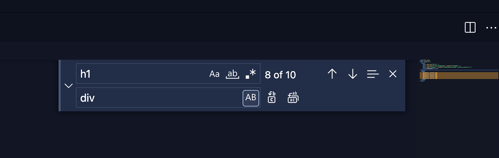

## 💻 단축키 연습

개발자로 취업한 지 1년이 되는 날이 약 11주 가량 남았다. 하지만 신입 개발자로서 그동안 단축키 사용을 제대로 하질 못했다.

코딩, 개발 속도가 느려지는 요인 중에 하나를 차지하리라 생각해서 이번 기회에 많이 쓸 법한 단축키를 연습해 보았다.

다 모르는 것은 아니지만 대부분 몰랐던 것이므로 일단 최대한 연습한 단축키를 블로그에 정리하기로 했다.

(이제서야 이걸... 😭 그래도 이제라도 할 수 있다는 것에 의의를 두며..)

## 💻 자주 쓰일 단축키

1. 사이드바 여닫기

   > Command + B

2. 빠른 열기

   > Command + P

3. 찾기

   > Command + F

   그런데 찾기를 하다가 해당되는 <code class="language-text">태그나 무엇인가를 바꾸고 싶을 때</code> 가 있다. 이 때는

   

   - Command + F 를 먼저 누른 상태에서 option 키를 누른 뒤 탭 키로 아래로 이동
   - 아래 input 에 원하는 태그 나 수정 내역을 적고
   - Command + F 로 선택된 부분의 태그만 바꾸려면 수정 후 Enter
   - 선택된 부분의 태그 모두를 파일 내에서 바꾸려면 Command + Enter

4. 줄 위 (or 아래) 로 이동하기

   > Option(alt) + Up or Down

   원하는 코드의 줄 끝에 커서를 위치하고 해당 단축키를 사용하면 현재 줄의 코드가 줄 위로 이동을 한다. 코드 블럭을 드래그 해도 마찬가지로 적용된다.

5. 위(or 아래) 에 줄 복사하기

   > Option(alt) + Shift + Up or Down

   원하는 코드 줄 아무데나 커서를 올려 놓고 해당 단축키를 사용하면 코드 위 또는 코드 아래에 줄이 복사된다.

6. 들여쓰기와 내어쓰기

   > Tab (For indent)

   > Shift + Tab (For outdent)

7. 이전 편집기 열기 (좌측 창으로 전환)

   > Command + Shift + [

   여러 탭을 열고 작업할 때 작업하는 해당 탭의 왼쪽 탭으로 전환하고자 할 때 사용한다.

8. 다음 편집기 열기 (우측 창으로 전환)

   > Command + Shift + ]

   여러 탭을 열고 작업할 때 작업하는 해당 탭의 오른쪽 탭으로 전환하고자 할 때 사용한다.

9. 편집기 분할

   항상 작업할 때 마우스 로 눌러서 사용했었다.

   > Command + \ (backslash)

10. 편집기 닫기

    > Command + W

## 💻 마치며

별 것 아닌 것 처럼 보일지 몰라도 직접 사용하고 연습해보니 신세계였다. 특히 3번 부터 6번까지는 정말 알고 있었으면 편했을 텐데 라는 생각이 절로 들어 숙연해졌다.

부끄럽지만 연습을 좀 더 해야겠다.

```toc

```
