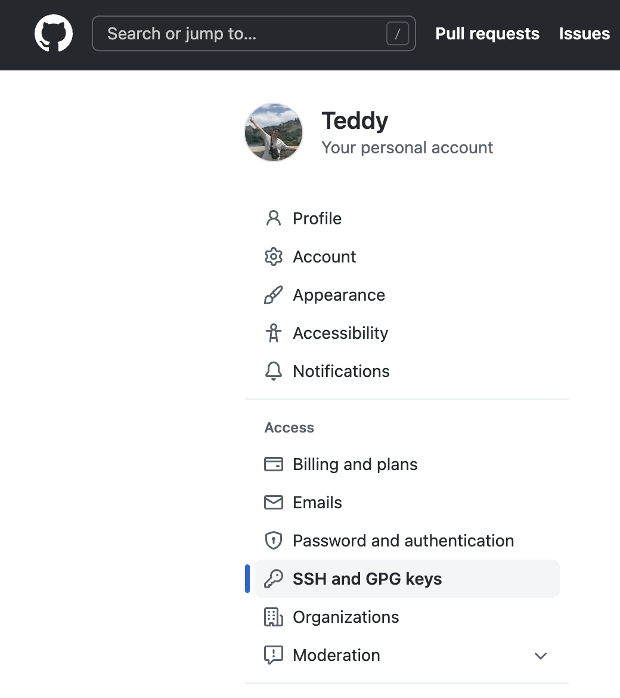
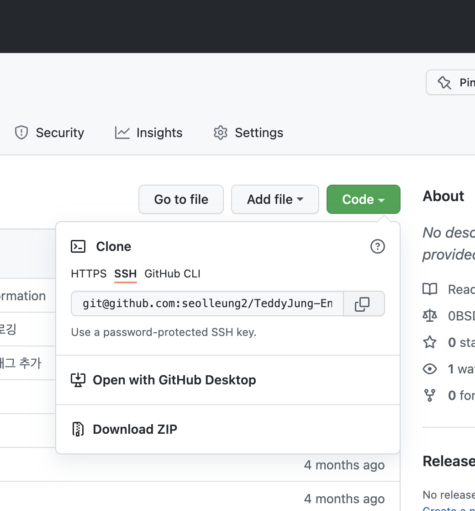

## 🎩 회사 업무용 맥북에서 개인 계정의 github 사용하기

입사 첫날 초기 Github 설정을 통해 이미 회사 계정의 github 을 컴퓨터에 연동했었다.

이후 개인 계정의 github 을 추가로 연동해 개인 github 계정의 repo (gatsby 블로그 등) 에 커밋을 하기 시작하다가 한동안 사용을 하지 않았다.

그래서 다시 연동을 하는 상황이 왔는데 이번 기회에 방법을 블로그에 적어 놓아야 다음 번에 헤메지 않을 거 같았다.

## 🎩 1. ssh-key 생성하기

터미널에 아래 코드와 같이 깃허브 계정의 이메일을 입력한다.

```bash
ssh-keygen -t rsa -C "example@gmail.com"
```

그러면 "Enter file in which to save the key" 라는 메시지가 뜨는데 key 가 저장될 위치는 그대로 두고 <br /> 계정을 구분지을 수 있도록 파일명만 변경해 준다.

이 과정이 끝나면 .ssh 폴더 밑에 id_rsa과 id_rsa.pub 파일이 생성된다.

나의 경우는 company-git 과 personal-git 으로 두 쌍의 파일을 생성했다. (이미 생성되어 있었다)

.ssh 경로 내에 하나의 계정을 추가할 때마다 "company-git", "company-git.pub" 처럼 한 쌍의 파일이 동시에 생성됨을 확인할 수 있다.

## 🎩 2. ssh-key 적용하기

vi ~/.ssh/config 명령어를 통해 config 파일을 생성하여 아래와 같은 내용을 추가해 준다.

(이미 들어 있었다)

```bash
# company
Host company-github.com
HostName github.com
User git
IdentityFile ~/.ssh/company-git

# personal
Host personal-github.com
HostName github.com
User git
IdentityFile ~/.ssh/personal-git
```

Host 키워드 뒤에는 Git Clone 시 github repository 에 연결할 url 이름이 된다.

IdentityFile 뒤에는 아까 1 에서 추가한 ssh-key 의 파일 경로 위치를 넣어주면 된다.

## 🎩 3. ssh-key 등록하기

ssh-add 명령어를 입력해 ssh-key 를 등록해 준다.

나의 경우는 "personal-git" 에 한해서만 ssh-key 를 등록했다.

```bash
ssh-add ~/.ssh/personal-git

Identity added: /Users/teddy/.ssh/personal-git (seolleung22@gmail.com)
```

Identity added ~~ 라는 메시지가 뜨면 잘 등록된 것이다.

## 🎩 4. ssh-key 등록하기

아래 명령어를 터미널에 입력하면 ssh-rsa 로 시작하여 본인 이메일로 끝나는 ssh-key 값이 나오는데, 이 값을 복사하여 github 에 등록하는 과정이 필요하다.

```bash
cat ~/.ssh/personal-git.pub
```

<br />
이제 자신의 깃허브 계정에서 settings ▸ SSH and GPG keys ▸ New SSH keys 버튼을 눌러 위의 터미널에서 복사한 ssh-key 를 붙여넣어 주고 저장한다.
<br />
<br />



이제 ssh -T personal-github.com 명령어로 정상적으로 ssh-key 가 연결되었는지 확인해 본다.

```bash
ssh -T personal-github.com
Hi teddy! You've successfully authenticated, but GitHub does not provide shell access.
```

## 🎩 5. Clone Github Repository

Clone 받고자 하는 Repo 에 들어가서 Code 버튼을 누르고 SSH 탭을 누르면 아래와 같은 화면이 나온다.
<br />



전부 복사한 다음 "git@" 뒤에 .ssh/config 파일에서 정한 Host 이름을 넣어줘야 한다. 이렇게 하면 Host 에 맞는 ssh 키를 찾아 클론한다.

```bash
git clone git@personal-github.com:teddy/TeddyBlog.git
git clone git@github.com-userA:github계정/repo이름.git
```

<br />
clone 이후에는 해당 로컬 Repo 로 이동한 뒤 아래 명령어를 통해 계정을 설정한다.

git 의 초기 global 계정 (회사계정) 과 충돌하지 않고 따로 계정을 관리해 주기 위함이다.

```bash
git config --local user.name "Your Name"
git config --local user.email "Your Email"
```

이제 해당 레포에서 commit, push 등을 그대로 진행하면 된다.

```toc

```
